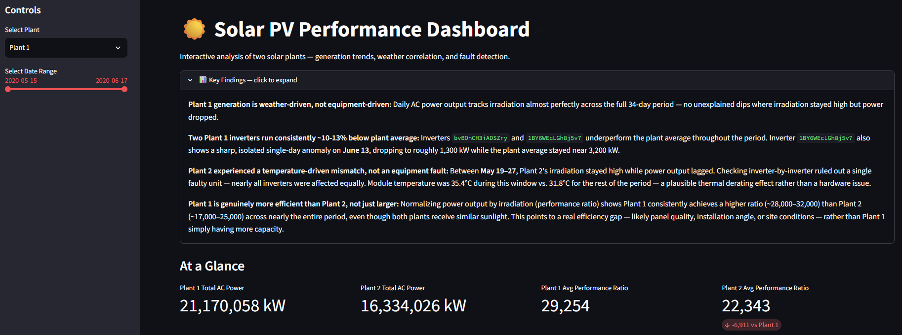

# ☀️ Solar PV Performance Dashboard

**[🔗 Live Interactive Dashboard]https://solar-pv-performance-dashboard-hd3ujgp4tmv2zrcurezp67.streamlit.app/** — click to explore

An interactive dashboard analyzing solar PV generation performance across two solar plants, built to replicate real-world solar analytics workflows — daily production trends, weather correlation, inverter-level fault detection, and cross-plant efficiency comparison.

## Problem Statement

Solar asset operators need to continuously validate whether generation is meeting expectations, and diagnose the cause when it isn't — is a dip due to weather, or an equipment issue? This project applies that exact workflow (drawn from hands-on solar PV analytics and M&V experience) to a public dataset, using Python to automate the kind of performance diagnostics typically done manually in Excel.

## Data Source

[Solar Power Generation Data](https://www.kaggle.com/datasets/anikannal/solar-power-generation-data) (Kaggle) — 15-minute interval generation and weather sensor data from two solar plants (22 inverters each) over a 34-day period.

## Key Findings

- **Plant 1's daily generation is fully explained by weather.** AC power output tracks irradiation almost perfectly across the full period, with no unexplained dips — a sign of a healthy, well-functioning plant.

- **Two Plant 1 inverters consistently underperform by ~10-13%**, and one of them (`1BY6WEcLGh8j5v7`) shows a sharp, isolated single-day anomaly on June 13 — a strong candidate for a maintenance flag.

- **Plant 2 experienced a temperature-driven dip, not an equipment fault.** Between May 19-27, irradiation stayed high while power output lagged. Ruling out individual inverters (nearly all were affected equally) and cross-checking module temperature (35.4°C during the window vs. 31.8°C otherwise) points to thermal derating rather than a hardware issue.

- **Plant 1 is genuinely more efficient than Plant 2 — not just larger.** Normalizing output by irradiation (performance ratio) shows Plant 1 consistently outperforms Plant 2 (~28,000-32,000 vs. ~17,000-25,000) even though both receive similar sunlight, pointing to a real efficiency gap in panel quality, installation, or site conditions.

## Dashboard Features

- Plant selector (Plant 1 / Plant 2)
- Interactive date range slider — filters every chart in sync
- Daily generation trend
- Irradiation vs. power comparison (dual-axis)
- Inverter-level fault detection with highlighted lowest/highest performers
- Cross-plant performance ratio comparison
- KPI summary cards



## Tech Stack

- **Python** — pandas, matplotlib
- **Streamlit** — interactive dashboard
- **Jupyter Notebooks** — exploratory analysis

## Running Locally

```bash
git clone https://github.com/tmugomba/solar-pv-performance-dashboard.git
cd solar-pv-performance-dashboard
python -m venv venv
venv\Scripts\activate
pip install -r requirements.txt
streamlit run app.py
```

## Project Structure

```
solar-pv-performance-dashboard/
├── data/           # Raw CSV files (solar generation + weather sensor data)
├── notebooks/      # Exploratory analysis notebooks
├── outputs/        # Saved chart images
├── app.py          # Streamlit dashboard
└── requirements.txt
```
